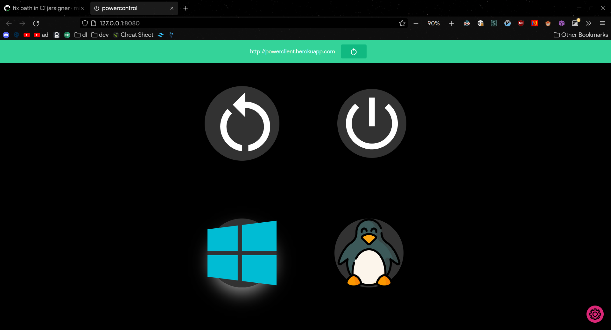
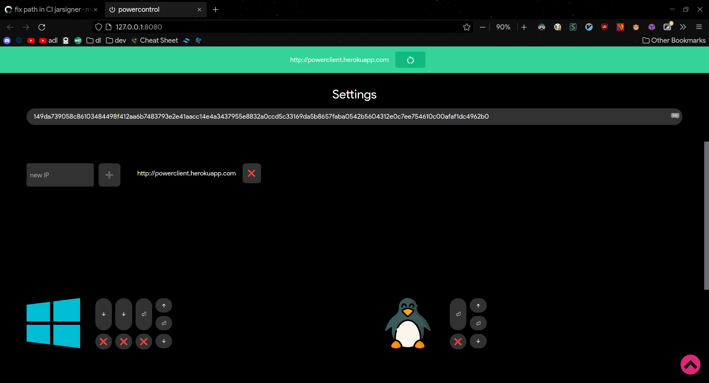
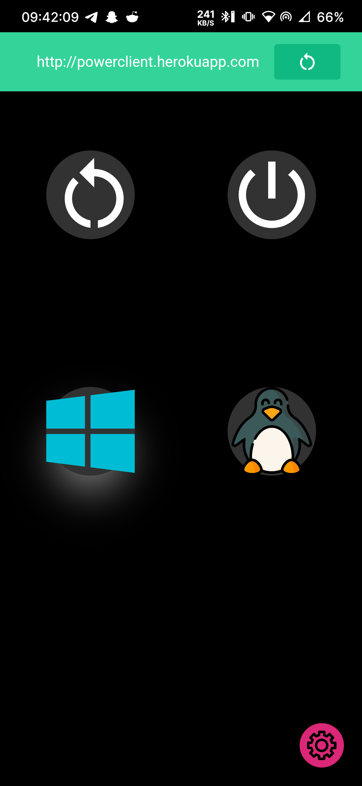
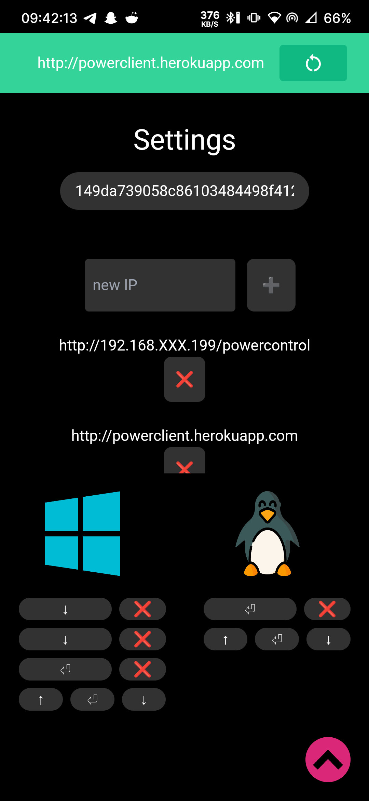

a raspberry pi on my computer case, with a serial connection to the motherboard to control the GRUB entry, and a relay to simulate the power and reset button of my case.
so i can turn on, off, reset and choose to boot on windows or linux from a web app, and available on mobile with capacitor.

todo : better readme + pictures of the setup irl

feel free to ask anything it was a fun project not very well documented

# pictures

  
  

  
  

