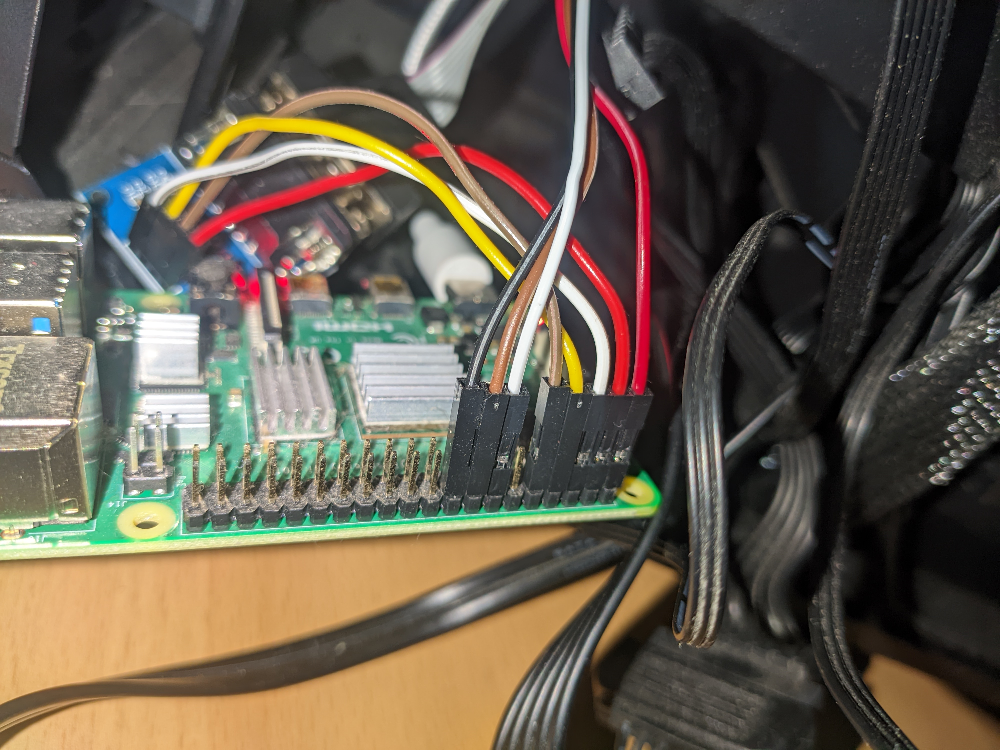

motherboard power and reset pins <-> relay <-> raspberry <-> capacitor app

also a serial connection with the motherboard to control GRUB entry (boot into linux or windows from the app)

feel free to open a issue for questions

# pictures

  
  
  
  

  
  

